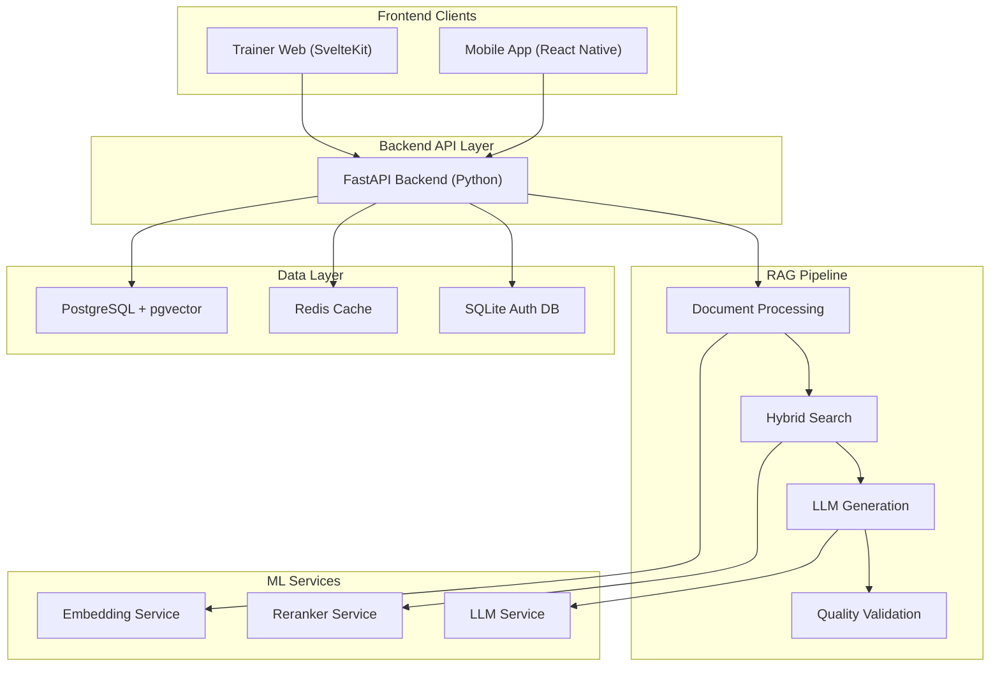
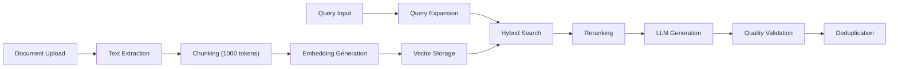

Based on my analysis of the codebase, I can now provide a comprehensive explanation of the project architecture. Let me create a structured overview:

## 🏗️ Project Architecture: QuestionGeneration AI

### **Overview**
QuestionGeneration AI is a **stateful RAG-based question generation system** for educators, built with a **microservices architecture** using FastAPI backend, React Native mobile app, and SvelteKit trainer web interface [[README.md:1-50]].

### **Architecture Diagram**



### **Core Components**

#### **1. Backend Architecture (FastAPI)**
- **Framework**: FastAPI with async/await support [[backend/app/main.py:1-20]]
- **API Structure**: Versioned REST API (`/api/v1/`) with modular endpoints [[backend/app/api/v1/router.py:1-19]]
- **Authentication**: JWT with refresh tokens + Redis blacklist [[backend/app/core/config.py:45-60]]
- **Database**: Dual-database approach:
  - **PostgreSQL + pgvector**: Main data store with vector embeddings [[backend/app/core/database.py:1-50]]
  - **SQLite**: Decoupled authentication database [[backend/app/core/auth_database.py:1-20]]

#### **2. RAG Pipeline Architecture**


**Key Pipeline Components**:
- **Hybrid Search**: BM25 + pgvector cosine similarity with score fusion [[README.md:50-60]]
- **Smart Chunking**: RecursiveCharacterTextSplitter (1000 tokens, 200 overlap) [[backend/app/core/config.py:120-130]]
- **Cross-Encoder Reranking**: `mixedbread-ai/mxbai-rerank-large-v1` [[backend/app/core/config.py:135-140]]
- **Embedding Cache**: Two-tier caching (L1: LRU, L2: Redis) [[backend/app/core/config.py:125-130]]

#### **3. Service Layer Architecture**

| Service | Purpose | Key Features |
|---------|---------|--------------|
| **QuestionService** | Core RAG pipeline | Hybrid search, deduplication, quality validation [[backend/app/services/question_service.py:1-50]] |
| **DocumentService** | Document processing | OCR, chunking, embedding generation |
| **LLMService** | LLM orchestration | Multi-provider support (Ollama, Gemini, DeepSeek) [[backend/app/services/llm_service.py:1-20]] |
| **EmbeddingService** | Vector embeddings | Caching, similarity computation |
| **RerankerService** | Result refinement | Cross-encoder reranking |

#### **4. Multi-Client Architecture**

| Client | Technology | Purpose |
|--------|------------|---------|
| **Mobile App** | React Native (Expo) | Teacher interface for document upload and question generation [[README.md:200-220]] |
| **Trainer Web** | SvelteKit + TailwindCSS | Vetter portal for question review and training pipeline [[trainer-web/package.json:1-45]] |

#### **5. Training Pipeline (LoRA Fine-Tuning)**
- **Feedback Loop**: Generate → Vet → Fine-tune → Deploy [[README.md:400-450]]
- **Data Collection**: SFT/DPO pairs from approved/rejected questions
- **Fine-Tuning**: LoRA adapters on base models (DeepSeek-R1-Distill-Llama-1.7B) [[backend/app/core/config.py:160-165]]
- **Version Management**: Model version activation and rollback

### **Infrastructure Architecture**

#### **Docker Compose Services** [[docker-compose.yml:1-258]]
```yaml
Services:
  - db: PostgreSQL + pgvector (vector database)
  - redis: Caching and session management
  - api: FastAPI backend application
  - trainer_web: SvelteKit web interface
```

#### **Data Flow**
1. **Document Processing**: Upload → OCR → Chunking → Embedding
2. **Question Generation**: Query → Hybrid Search → Reranking → LLM Generation → Validation
3. **Training Loop**: Vetting → Data Collection → Fine-tuning → Model Deployment

### **Key Design Decisions**

1. **Decoupled Authentication**: SQLite auth DB separate from vector DB for security [[backend/app/core/config.py:45-50]]
2. **Multi-LLM Provider Support**: Ollama (local), Gemini, DeepSeek (cloud) [[backend/app/core/config.py:70-90]]
3. **Hybrid Search**: Combines keyword (BM25) and semantic (vector) search [[README.md:50-60]]
4. **Two-Tier Caching**: In-memory LRU + Redis persistence for embeddings [[backend/app/core/config.py:125-130]]
5. **Streaming Responses**: Server-Sent Events (SSE) for real-time generation [[README.md:100-110]]

### **Monitoring & Observability**
- **Health Checks**: `/health` endpoint with service status [[backend/app/main.py:180-194]]
- **Metrics**: Prometheus metrics at `/metrics` [[backend/app/main.py:140-150]]
- **Logging**: Structured JSON logs with request IDs [[backend/app/main.py:100-120]]

### **Deployment Architecture**
- **Development**: Docker Compose with hot reload
- **Production**: Multi-container deployment with resource limits
- **GPU Support**: DGX/Spark deployment configurations available [[docker-compose.dgx.yml:1-50]]

## **TL;DR**
**QuestionGeneration AI** is a **microservices-based RAG system** with:
- **FastAPI backend** with dual databases (PostgreSQL+pgvector + SQLite auth)
- **Hybrid RAG pipeline** combining BM25 + vector search + cross-encoder reranking
- **Multi-client support**: React Native mobile + SvelteKit web interfaces
- **Training feedback loop** for continuous LLM improvement via LoRA fine-tuning
- **Containerized deployment** with Docker Compose supporting local, cloud, and GPU environments

The architecture emphasizes **modularity**, **scalability**, and **educator workflow integration** with a focus on generating high-quality, curriculum-aligned assessment questions.